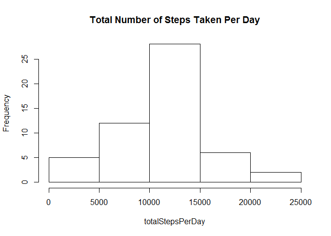
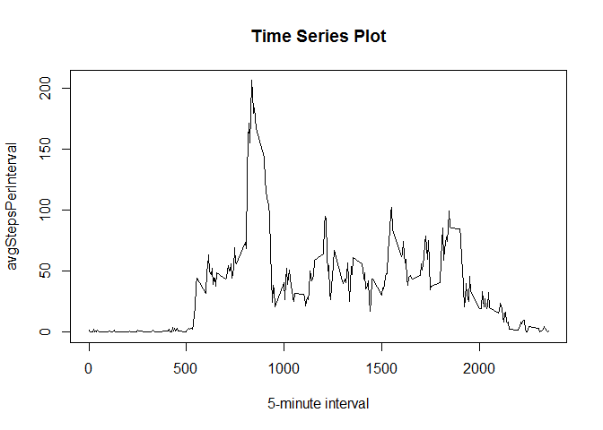
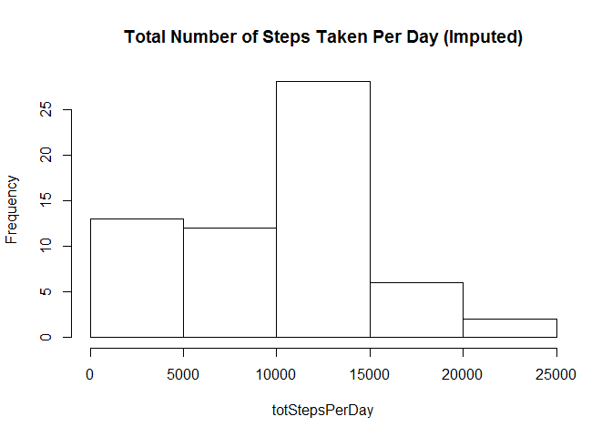
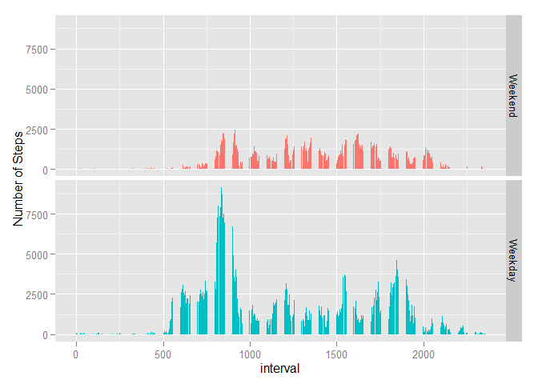

# Reproducible Research: Peer Assessment 1

## Loading and preprocessing the data

```r
setwd("C:/Users/Susan/RepData_PeerAssessment1")
dat = read.csv("activity.csv", header = T)
```

## What is mean total number of steps taken per day?
Here, we will ignore any missing values in the dataset.


```r
#We can ignore missing values so create data set with no missing values
noMiss=dat[complete.cases(dat),]

#calculate total steps taken per day
totalStepsPerDay=with(noMiss,tapply(steps,date,sum))

#make a histogram of the total number of steps taken each day
hist(totalStepsPerDay,main="Total Number of Steps Taken Per Day")
```

 

```r
#Calculate and report the mean and median of the total number of steps taken per day
avgTotal=mean(totalStepsPerDay[complete.cases(totalStepsPerDay)])
davgT=formatC(avgTotal,format="d")
medianTotal=median(totalStepsPerDay[complete.cases(totalStepsPerDay)])
dmedT=formatC(medianTotal,format="d")
```
The mean of the total number of steps taken per day is 10766.
The median of the total number of steps taken per day is 10765.

## What is the average daily activity pattern?

```r
#calculate avg steps taken per interval
avgStepsPerInterval=with(noMiss,tapply(steps,interval,mean))
#avgStepsPerInterval(key=names(avgStepsPerInterval),value=avgStepsPerInterval
                    
##Make a time series plot of the 5-minute intervals on the x-axis (0 to 2355)
## and the average number of steps taken averaged across all days
intervals=as.numeric(names(avgStepsPerInterval))
plot(intervals,avgStepsPerInterval,type="l",main="Time Series Plot",xlab="5-minute interval")
```

 

Which 5-minute interval, on average across all the days in the dataset, contains the maximum number of steps?


```r
index=match(max(avgStepsPerInterval),avgStepsPerInterval)
ans=names(avgStepsPerInterval)[index]
av=max(avgStepsPerInterval)
avd=formatC(av,format="d")
```
The 5-minute interval at 835 contains the maximum number of average steps at 206.

## Imputing missing values
All missing values in the dataset will be replaced with zeros

```r
## Calculate and report the total # of rows with missing values
rowsMissing=sum(!complete.cases(dat))

## Fill in all the missing values in the dataset with zeros
filledData=dat
filledData[is.na(filledData)]=0
```
Below is a histogram of the total number of steps taken each day for the imputed data


```r
#calculate total steps taken per day
totStepsPerDay=with(filledData,tapply(steps,date,sum))
#make a histogram of the total number of steps taken each day
hist(totStepsPerDay,main="Total Number of Steps Taken Per Day (Imputed)")
```

 


```r
impMean=mean(totStepsPerDay)
dMean=formatC(impMean,format="d")
impMed=median(totStepsPerDay)
dMed=formatC(impMed,format="d")
```
The mean of the total number of steps taken per day for the imputed data is 9354.
The median of the total number of steps taken per day for the imputed data is 10395.

We can see that the mean and median values are lower for the imputed data since a large number of zero values were added in to compute the mean and median. 

## Are there differences in activity patterns between weekdays and weekends?


```r
library(timeDate)
weekDay=isWeekday(as.Date(filledData$date))
day=factor(weekDay,labels=c("Weekend","Weekday"))

#create a panel showing number of steps across a day for weekends and weekdays
gData=cbind(filledData,day)
library(ggplot2)
g<-ggplot(aes(x = interval, y = steps, fill=day), data=gData)
g+geom_bar(stat="identity")+
  facet_grid(day~.)+
  labs(x="interval", y="Number of Steps")+
  guides(fill=FALSE)
```

 
 
As seen in the graph, there are differences seen in activity based on weekends and weekdays.  Overall, it appears people are taking more steps on a weekday versus a weekend.
